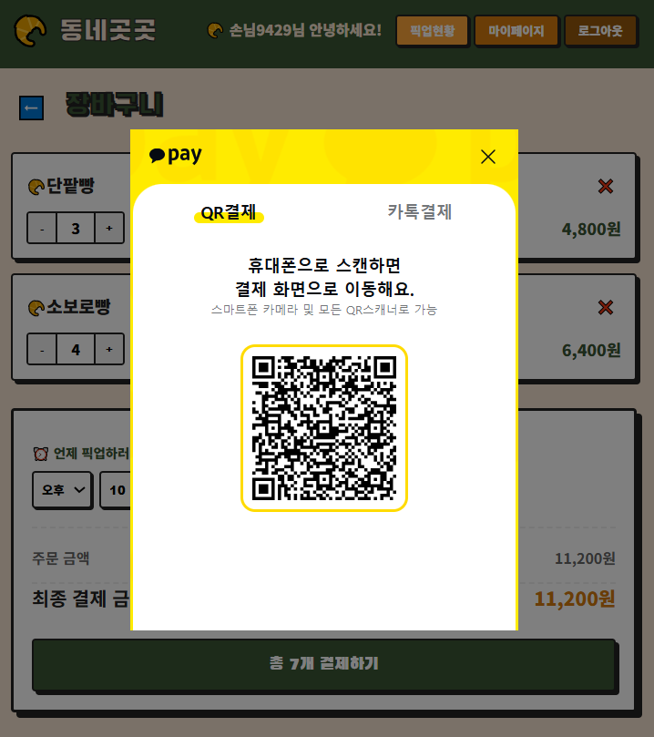
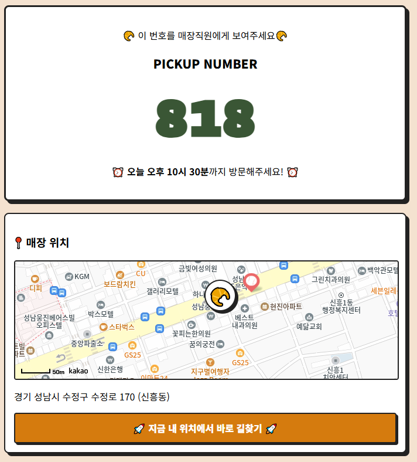
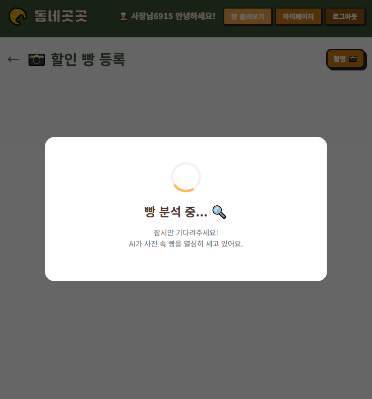
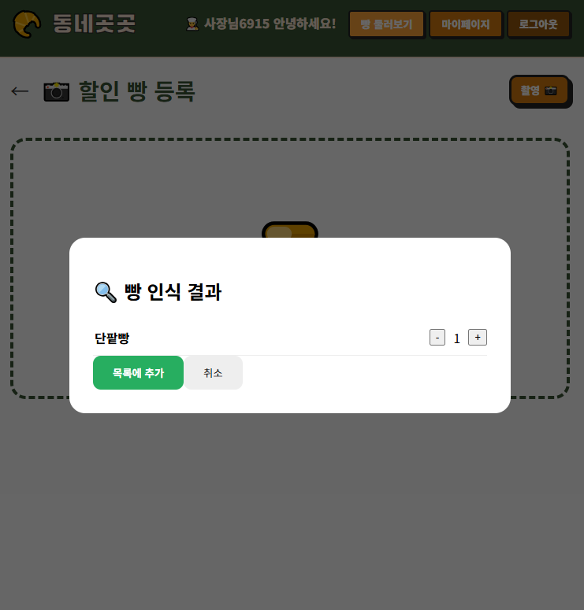

# 🥐 동네곳곳

> 버려질 수 있는 빵을 할인 판매로 연결하는 위치 기반 서비스

---

## 📌 소개

동네 베이커리의 남은 빵을 할인 판매로 연결하여

* 사장님은 재고를 줄이고
* 사용자는 저렴하게 구매할 수 있도록 만든 서비스입니다.

---

## ❓❗ Problem

### 👤 사용자 입장
- 주변 할인 빵 정보를 찾기 어려움

### 🏪 사장님 입장
- 상품을 직접 등록해야 하는 번거로움 존재

---

## 💡 Solution

수작업 상품 등록의 불편함을 해결하기 위해  
OCR 및 객체 탐지 기반 자동 인식 기능을 도입

→ 사진 촬영만으로 상품 등록 가능하도록 설계

---

## 🧠 AI Pipeline

초기에는 객체 탐지 기반으로 바로 인식하도록 설계했으나,  
처리 속도와 비용 문제를 고려하여 다음과 같이 개선했습니다.

1. 전체 이미지 OCR 수행  
2. OCR 실패 시 네임텍 영역 탐지 (Roboflow)  
3. 해당 영역 crop 후 OCR 재시도  
4. 최종적으로 빵 이미지 기반 매칭  

→ 객체 탐지 호출을 최소화하여 성능 및 비용 최적화

---
  
## 🖼️ 화면

### 메인 화면

<p align="center">
  
  
  
</p>

### 장바구니

<p align="center">
  
</p>

### 결제

<p align="center">
  
</p>

### 주문서

<p align="center">
  
</p>

### 빵 인식 (OCR + AI)

<p align="center">
  
  
</p>

---

## ⚙️ 주요 기능

* 위치 기반 매장 조회
* 할인 빵 리스트 제공
* 장바구니 및 주문 기능
* 재고 관리 및 자동 차감
* OCR + 객체 탐지 기반 빵 인식

---

## 🧠 핵심 구현

### 1. 빵 인식 파이프라인

```
OCR → 네임택 탐지 → 이미지 분류
```

### 2. Product 기반 데이터 구조

* 상품명 / OCR / AI 분류를 하나의 기준(Product)으로 통일

```python
display_name = serializers.CharField(source='product.display_name', read_only=True)
```

---

## 🧱 기술 스택

* Backend: Django, DRF
* Frontend: Vue3
* AI: Google Vision OCR, Roboflow

---

## 🚀 실행 방법

```bash
# backend
python manage.py runserver

# frontend
npm install
npm run dev
```
